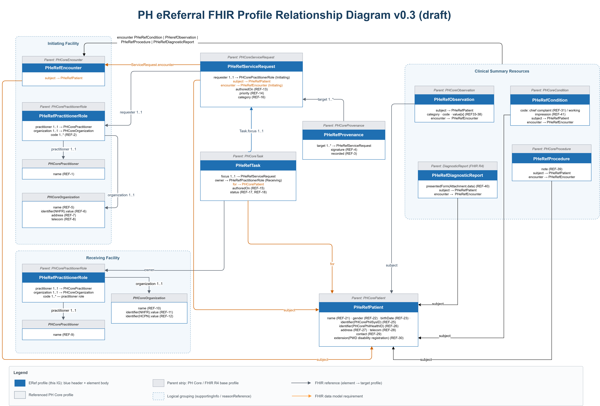

# Logical Information Model - PH eReferral Implementation Guide v0.1.0

## Logical Information Model

# v0.1 Referral Logical Information Model

## Purpose

This page describes the logical information model for the v0.1 PH eReferral package. It defines the main groups of information that should be available for a safe referral handover before describing how those groups relate to current PeReF FHIR profiles, examples, and illustrative RESTful interactions.

The logical information model is not the workflow model, state model, final data dictionary, or production API specification. It is a reviewer-facing bridge between the referral dataset and the FHIR implementation artifacts. Future use-case-specific datasets, such as pregnancy referral, should reuse this core logical model structure and add approved clinical content where needed.

## Guiding Principle

For v0.1, PeReF uses the principle that a referral package should contain enough core information for the receiving facility to:

* identify the patient;
* understand why the referral is needed;
* judge urgency and receiving-facility readiness;
* review the relevant clinical context;
* know what care, treatment, or coordination has already occurred;
* know who sent the referral and how to follow up;
* determine who is expected to receive, triage, or act on it;
* respond or redirect safely;
* who is making the referral or where the referral is coming from.

Use-case-specific referrals may require additional clinical details, but those details should extend the core referral package rather than replace it.

## Use-Case Extensibility

The information groups below define the reusable referral envelope. Later use cases should keep the same core groups for patient identity, sending and receiving context, referral request, workflow tracking, response, and audit.

Specialty or program-specific datasets should add clinical content under the clinical reason, clinical context, and prior care groups. For example, a future pregnancy referral use case could add gestational age, estimated delivery date, antenatal care history, maternal danger signs, fetal status, relevant observations, procedures, and treatment already given without changing the core referral envelope.

## Logical Information Groups

The groups below describe what the referral package needs to communicate before considering the physical FHIR representation.

| | | | |
| :--- | :--- | :--- | :--- |
| Patient identity | Who is being referred? | Prevents misidentification and supports patient matching, contact, handover, and billing. | [ERefPatient](StructureDefinition-ereferral-patient.md);`ServiceRequest.subject`;`Task.for`;`Encounter.subject`. |
| Sending context | Who created or sent the referral? | Supports accountability, callback, role, and originating facility context. | [PH eReferral PractitionerRole](StructureDefinition-ereferral-practitioner-role.md); Practitioner; Organization;`ServiceRequest.requester`;`Task.requester`. |
| Receiving context | Who is expected to receive, triage, or perform the requested service? | Supports routing, triage, receiving-facility preparation, and assignment of responsibility. | Organization;[PH eReferral PractitionerRole](StructureDefinition-ereferral-practitioner-role.md);`ServiceRequest.performer`;`Task.owner`. |
| Referral request | What service, consultation, procedure, or action is being requested? | Defines the operational purpose of the referral and the urgency of action. | [EReferral ServiceRequest](StructureDefinition-ereferral-service-request.md);`ServiceRequest.code`;`category`;`priority`;`authoredOn`;`occurrence[x]`;`replaces`. |
| Clinical reason | Why is the referral needed? | Helps the receiving side triage, accept, redirect, or prepare for the patient. | `ServiceRequest.reasonCode`;`ServiceRequest.reasonReference`; Condition; Observation. |
| Clinical context and prior care | What is the patient's current condition, and what has already been done? | Supports safe handover, continuity of care, and avoidance of duplicate or unsafe treatment. | `ServiceRequest.supportingInfo`; Observation; Condition; Procedure;[EReferral MedicationAdministration](StructureDefinition-ereferral-medication-administration.md);[ERefImmunization](StructureDefinition-ereferral-immunization.md). |
| Workflow and response tracking | Where is the referral in the process, and what has the receiving side reported? | Tracks responsibility, response, redirection, and closure without changing the clinical referral request itself. | [EReferral Task](StructureDefinition-ereferral-task.md);`Task.focus`;`Task.status`;`Task.businessStatus`;`Task.statusReason`;`Task.output`. |
| Audit and provenance | Who submitted, signed, or changed referral information? | Supports traceability, trust, review, and medico-legal accountability. | [EReferral Provenance](StructureDefinition-ereferral-provenance.md);`ServiceRequest.relevantHistory`;`Provenance.target`;`Provenance.recorded`;`Provenance.agent`;`Provenance.signature`. |

## v0.1 Data Dictionary Traceability

The data dictionary remains the source of individual data elements. This page groups the v0.1 general referral elements into referral-package concepts so reviewers and implementers can discuss the dataset without starting from FHIR paths.

Current draft mapping references include these v0.1 row clusters and gap annotations so missing row numbers are not read as accidental omissions:

| | | |
| :--- | :--- | :--- |
| Referring practitioner and role | REF-1, REF-2 | Sending context |
| Signature and recorded activity | REF-3, REF-4 | Audit and provenance |
| Initiating facility | REF-5 to REF-8 | Sending context |
| Care navigator and receiving facility | REF-9 to REF-11 | Receiving context; workflow tracking |
| Health Care Provider Network name | REF-12 | Sending context; receiving context; referral routing |
| Referral date, category, priority, supporting information, and reason | REF-13 to REF-16 | Referral request; clinical reason; clinical context |
| Receiving action points | REF-17, REF-18 | Workflow and response tracking |
| Return referral slip attachment | REF-19 | Future work; attachment exchange |
| Removed data dictionary row | REF-20 | Removed in current data dictionary |
| Patient demographics and contact details | REF-21 to REF-30 | Patient identity |
| Treatment given | REF-39 | Clinical context and prior care |

These row references should be verified against the approved data dictionary before release. Missing or changed rows should be updated from the source data dictionary, not inferred from this page. Future use-case-specific datasets should add their own approved row clusters and map them into the reusable logical groups.

## eReferral Profile Relationships

The diagram shows the current v0.3 draft PeReF profile relationships. It is not a complete catalogue of every future clinical profile that may be added for specialty or program-specific referral use cases.

| | | |
| :--- | :--- | :--- |
| Patient to referral request | `ServiceRequest.subject` | The patient being referred. |
| Sending side to request | `ServiceRequest.requester` | The practitioner, role, or facility responsible for creating the referral. |
| Receiving side to request | `ServiceRequest.performer` | The intended receiving facility or role. |
| Clinical reason to request | `ServiceRequest.reasonCode`;`ServiceRequest.reasonReference` | The reason the receiving side should evaluate the referral. |
| Supporting clinical information to request | `ServiceRequest.supportingInfo` | Clinical observations, conditions, procedures, treatment, medications, or immunizations needed for handover. |
| Workflow tracking to request | `Task.focus` | The Task tracking status, receiving response, assignment, and closure for the ServiceRequest. |
| Audit record to request | `ServiceRequest.relevantHistory`;`Provenance.target` | The provenance record for signatures, submissions, and updates. |
| ServiceRequest to Encounter | `ServiceRequest.encounter` | The encounter associated with acting on or closing the referral. |
| Clinical Summary Resources to Encounter | `Condition.encounter`;`Observation.encounter`;`Procedure.encounter`;`DiagnosticReport.encounter` | The encounter associated with the clinical summary resources. |

## Example FHIR RESTful Interaction Flow

The following flow is illustrative and non-normative. Do not treat it as a required API contract. Actual supported searches, update methods, transaction behavior, and security controls should be stated in the server CapabilityStatement and exchange agreement.

Each interaction implies a corresponding FHIR REST response, such as `200 OK`, `201 Created`, or an `OperationOutcome`. Standard HTTP responses are omitted from the diagram for readability.

| | | | |
| :--- | :--- | :--- | :--- |
| Create or update shared reference data | `POST /Patient`,`PUT /Patient/{id}`,`POST /Organization`,`POST /PractitionerRole` | ERefPatient, Organization, Practitioner, PractitionerRole | Use existing records when available. Create or update only when the exchange agreement allows it. |
| Create the referral request | `POST /ServiceRequest` | ERefServiceRequest | Carries patient, requester, receiving performer, requested service, urgency, reason, and supporting clinical references. |
| Create workflow tracking | `POST /Task` | ERefTask | `Task.focus`points to the ServiceRequest. Initial v0.1 exchange normally starts with a requested Task. |
| Read or search for referrals | `GET /Task?focus=ServiceRequest/{id}`,`GET /ServiceRequest?performer=Organization/{id}&status=active` | Task, ServiceRequest | These are example searches. Actual support belongs in the server CapabilityStatement. |
| Record receiving response | `PUT /Task/{id}`or`PATCH /Task/{id}` | ERefTask | Updates`Task.status`,`Task.businessStatus`,`Task.statusReason`, and/or`Task.output`depending on the response. |
| Record onward referral | `POST /ServiceRequest`;`PUT/PATCH /Task/{id}` | ServiceRequest, Task | An onward ServiceRequest can use`ServiceRequest.replaces`to link back to the previous referral request. |
| Record audit event or signature | `POST /Provenance` | ERefProvenance | Provenance can target the ServiceRequest and record signer, author, update, or other auditable activity. |
| Record encounter or closure context | `POST /Encounter`;`PUT/PATCH /Task/{id}` | ERefEncounter, Task | Encounter can point back to the referral using`Encounter.basedOn`. Task completion records closure of the workflow tracking item. |
| Submit as one package when supported | `POST /`with a transaction Bundle | Bundle containing the referral package resources | Transaction Bundles are useful for keeping references consistent, but server support and security rules must be confirmed. |

## Review Expectations

Reviewers should confirm:

* the logical groups match clinical and operational expectations for v0.1;
* the data dictionary row clusters are accurate;
* the profile relationships are consistent with the current PeReF profiles;
* REST interaction examples match the intended server CapabilityStatement;
* future use cases can extend clinical content without replacing the core referral envelope;
* production topics such as routing, consent, security, attachments, and exchange hosting are handled in the appropriate implementation guidance.

